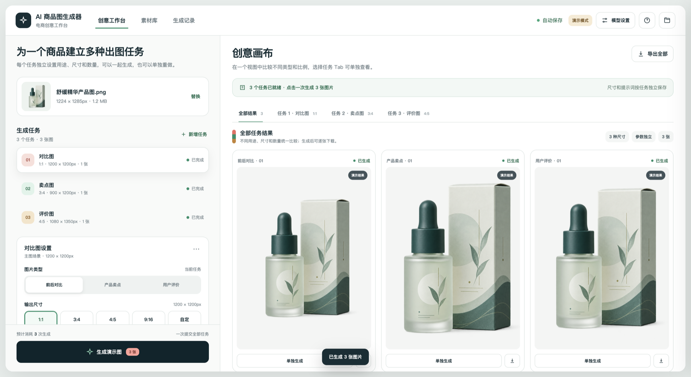

# AI 商品图生成器

一个可以在本机真实运行的 AI 电商商品图工作台。同一个商品可以建立多个独立任务，分别选择图片类型、输出比例、准确像素、提示词和生成数量，然后一起调用图片模型。



## 已实现能力

- 同一商品一次提交多个独立出图任务，每个任务单独选择类型、尺寸、提示词和 1–4 张数量。
- 支持 OpenAI 官方接口、兼容中转站的 Base URL + API Key + 自定义模型 ID，以及本机 Codex 桌面 Agent。
- 素材库、生成进度、失败提示、单任务重做、生成记录详情、整批导出和单图下载形成完整闭环。
- 下载文件会统一处理为任务选择的准确像素；API Key、素材和历史只保存在本机并排除出 Git。

## 启动

需要先安装 Node.js 20 或更高版本。

最简单的方式是在 Finder 中双击：

```text
启动 AI 商品图生成器.command
```

启动脚本会在首次运行时安装依赖，随后打开：

```text
http://127.0.0.1:4317/
```

也可以使用终端：

```bash
cd AI商品图生成器
npm install
npm start
```

不要直接双击 `index.html`。真实模型调用、素材保存和生成记录需要本地 Node.js 服务；如果误用 `file://` 打开，页面会显示正确的启动提示。

## 选择 AI 来源

右上角“模型设置”提供三种来源：

- `OpenAI 兼容 API`：可使用官方接口或第三方中转站，生成结果直接回到画布。
- `Codex 桌面 Agent`：不需要单独填写 API Key。先测试本机 Codex 的安装、ChatGPT 登录、网络和图片能力；测试通过后，点击“一键生成”即会在后台生成所有任务，结果自动回到画布。
- `演示模式`：只检查页面交互和精确尺寸，不会生成新的 AI 图片。

Codex 来源通过本机 CLI 直接调用图片生成能力，使用 `gpt-5.6-sol` 的低推理档负责任务调度，并使用用户的 Codex/ChatGPT 额度。

## 配置 OpenAI 图片模型

1. 打开页面右上角“模型设置”。
2. 选择“OpenAI API”。
3. 官方接口保持 Base URL 为 `https://api.openai.com/v1`；中转站则填写对方提供的兼容地址。
4. 填入 API Key。
5. 从常用图片模型中选择，或直接输入中转站提供的模型 ID。
6. 选择草稿、标准或精细质量。
7. 点击“保存并测试图片 API”或“保存设置”。

第三方中转站必须兼容 OpenAI 的 `/v1/images/edits` 图片编辑接口，并能返回 base64 图片数据。

API Key 只保存在本项目的 `.local/settings.json` 中，文件权限为当前用户可读写。网页接口只返回“是否已配置”，不会返回或显示完整 Key；`.local/` 已被 `.gitignore` 排除。

## 使用流程

1. 在素材库上传 JPG、PNG 或 WebP 商品图，单张最大 20 MB。
2. 返回创意工作台，创建最多 5 个生成任务。
3. 每个任务独立选择前后对比、产品卖点或用户评价类型。
4. 每个任务独立选择 1:1、3:4、4:5、9:16 或横版尺寸，并修改提示词、数量。
5. API 或 Codex 来源点击“一键生成”，所有任务一次提交。
6. 生成记录会保存任务参数、模型、成功图片和失败原因，重启后仍可读取。

界面中的目标尺寸就是最终下载尺寸。服务会把模型输出转换为选中的准确像素，例如 900×1200 或 1080×1350。

## 演示模式

演示模式不调用外部模型，而是用当前商品素材生成不同尺寸的本地结果，用于检查交互和尺寸流程；结果会明确标记为“演示结果”，不会冒充 AI 生成图。

## 项目结构

```text
AI商品图生成器/
├── index.html                 页面结构
├── styles.css                页面样式
├── app.js                    工作台、素材、历史和设置交互
├── api-client.js             同源本地 API 客户端
├── task-model.js             任务数据与尺寸选项
├── ai-source.js              AI 来源展示与选择规则
├── file-open-guard.js        直接打开 HTML 时的启动提示
├── server/
│   ├── index.js              本地服务入口
│   ├── create-app.js         HTTP API 与静态文件服务
│   ├── openai-image-provider.js  GPT Image 2 适配器
│   ├── codex-image-provider.js Codex CLI 批量生图适配器
│   ├── generation-service.js 生成、并发与准确尺寸处理
│   ├── desktop-agent-service.js Codex 桌面 Agent 连通性检测
│   ├── asset-store.js        素材持久化
│   ├── history-repository.js 历史记录持久化
│   └── settings-store.js     本机私密设置
├── .local/                   本机素材、生成图、历史和密钥（运行后创建）
└── tests/                    自动化测试
```

## 验证

```bash
npm run check
```

自动化测试不会调用付费图片模型。只有用户在页面主动点击生成时，才会使用 OpenAI API 费用或 Codex/ChatGPT 额度。
